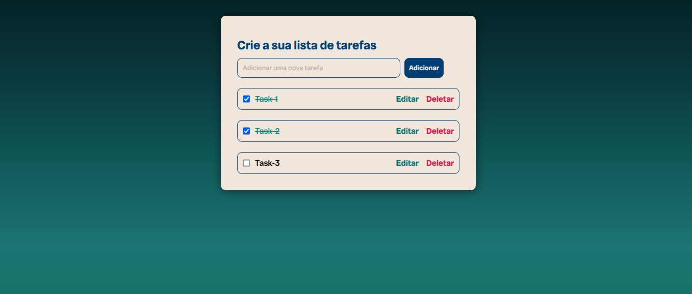
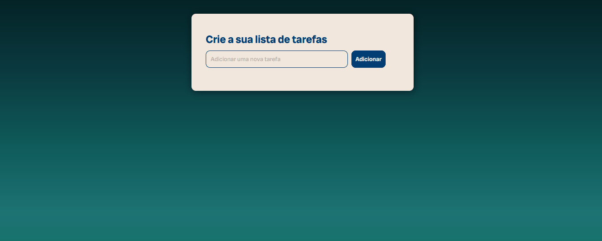

# To Do List JS

## Sumário

- [Visão geral](#visão-geral)
  - [O Projeto](#o-projeto)
  - [Screenshot](#screenshot)
- [Links](#links)
- [Meu processo](#meu-processo)
  - [Tecnologias](#tecnologias-usadas)
  - [O que eu aprendi](#o-que-aprendi)
  - [Dificuldades](#dificuldades)
- [Contato](#contato)

## Visão Geral

### O Projeto

Este projeto é um gerenciador de tarefas simples, onde o usuário pode adicionar, editar, concluir e deletar tarefas. O objetivo do projeto é fornecer uma interface amigável para gerenciamento de atividades, com funcionalidades básicas e uma experiência de usuário agradável.

### Screenshot

## Links

- Repositório: https://github.com/mazziera/To-do-List-JS

- Deploy: https://mazziera.github.io/To-do-List-JS/

## Meu Processo

### Tecnologias usadas:

- HTML5 
- CSS3
- Media Queries
- Flexbox
- JavaScript

### O que aprendi?

- <b>Planejamento:</b> Defini as funcionalidades principais (adicionar, editar, concluir e deletar tarefas); 

- <b>Implementação:</b> Escrevi o código HTML e JavaScript para implementar as funcionalidades básicas; 

- <b>Estilização:</b> Usei CSS para estilizar a interface do usuário;

- <b>Refinamento:</b> Adicionei uma animação de transição vertical ao modal de edição e ajustei as funções para garantir que todas as operações funcionem corretamente;

- <b>Comentários:</b> Adicionei comentários ao código para melhorar a legibilidade e facilitar a manutenção futura. 

- Manipular o DOM com JavaScript para criar, editar e remover elementos dinamicamente.

### Dificuldades

- <b>Gerenciamento de Estados:</b> Manter o estado correto das tarefas (adicionadas, editadas, concluídas) e refletir isso na interface.

- <b>Manipulação do DOM:</b> Garantir que os elementos DOM fossem corretamente criados, atualizados e removidos.

- <b>Animações CSS:</b> Implementar animações suaves e garantir que funcionassem corretamente em diferentes navegadores.

- <b>Eventos:</b> Garantir que os event listeners não fossem adicionados múltiplas vezes, causando comportamentos inesperados.

- Apesar dessas dificuldades, consegui superá-las e o projeto foi uma excelente oportunidade de aprendizado e prática das tecnologias envolvidas.

## Contato

- Github - [mazziera.io](https://github.com/mazziera)
- Linkedin - [@raphael-mazzieri](https://www.linkedin.com/in/raphael-mazzieri/)